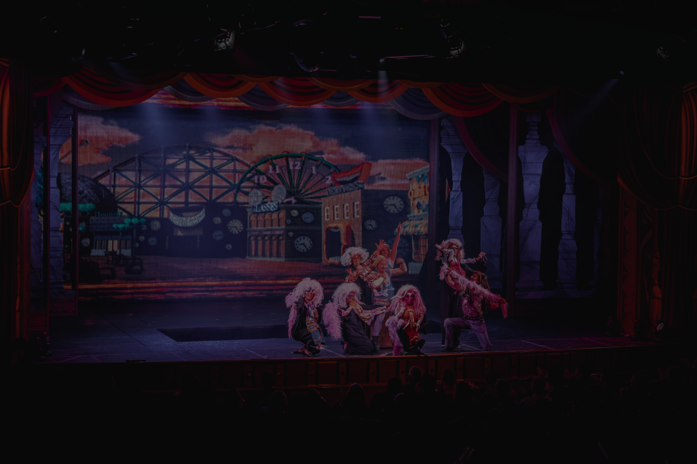

## ArtShow
  Farhan Hanif (22/504834/SV/21715)

## Penjelasan Website Secara Umum
  ArtShow merupakan sebuah website yang kami buat untuk mengenalkan berbagai event dari berbagai penyelenggara, serta mempermudah pembelian tiket event melalui pembayaran secara online. Saat ini, website ini memiliki beberapa bagian, seperti landing page, login, dan juga event dashboard.
  Website ini dibuat agar penyelenggara event dapat mengenalkan event yang digelarnya ke khalayak ramai dan juga mempermudah pemasaran tiket event tersebut melalui pemesanan dan pembayaran secara online.

## Requirement Dasar
1. Mengikuti Prinsip Desain
   ### Konsistensi
     - Setiap section pada halaman dibungkus dengan sebuah container sehingga jarak konten dalam setiap section terlihat sama
       ```css
       .content-wrap {
          padding: 80px;
        }
        ```
       
   ### Pemilihan Warna
      - Beberapa warna utama yang digunakan dalam website ini yaitu: #121328 (biru tua - navy), #fff (putih), #D35252 (merah jambu), #4F1F23 (coklat tua), #A07A4E (emas), #6D7FAE (biru muda), dan #aeaeae (abu-abu). Kemudian, berbagai warna tersebut dikombinasikan dengan memperhatikan juga mengenai readibility atau kemudahan membacanya.
        
   ### Hierarki Penulisan
      - Penulisan teks pada website ini juga memperhatikan hierarki penulisan, di mana teks yang penting atau perlu dibaca terlebih dahulu akan dibuat "berbeda" dari teks yang lain. Teks tersebut dapat dibuat lebih "berbeda" dengan mengubah ukuran menjadi lebih besar dan mengganti warna berbeda dari yang lain sehingga pembaca akan membaca yang terlihat berbeda terlebih dahulu.

   ### Screenshot
   
   
   
   
   


2. Website Responsive
   Tampilan pada website ini akan otomatis menyesuaikan bergantung pada ukuran layar pengguna, hal ini dikarenakan pembuatan website ini menggunakn css dari bootstrap dan juga media query sehingga pembuatan tampilan yang responsif lebih mudah.

    Mengimport css dan js dari bootstrap:
    ```html
    <head>
      ...
      <link href="css/bootstrap.min.css" rel="stylesheet">
      <script src="js/bootstrap.bundle.min.js"></script>
      <link href="style.css" rel="stylesheet">
      <script type="text/javascript" src="script.js"></script>
      ...
    </head>
    ```

     Kemudian menerapkan bootstrap yang telah diimport, misal pada bagian navigation bar diberi row dan juga col, kemudian apabila layarnya diperkecil maka navbar akan menjadi hamburger:
   ```html
    <div class="navigation">
      <div class="row align-items-center">
        <div class="col-auto">
          <div class="nav-left-side">
            <ul class="navbar-nav">
              <li><a href="logout.php">Logout</a></li>
            </ul>
          </div>
        </div>
        <div class="col d-flex justify-content-end">
          <nav class="navbar navbar-expand-lg">
            <div class="container-fluid">
              <button class="navbar-toggler" type="button" data-bs-toggle="collapse" data-bs-target="#navbarNav"
                aria-controls="navbarNav" aria-expanded="false" aria-label="Toggle navigation">
                <span class="navbar-toggler-icon"></span>
              </button>
              <div class="collapse navbar-collapse" id="navbarNav">
                <ul class="navbar-nav">
                  <li><a href="index.php">Home</a></li>
                  <li><a href="#">Invoice</a></li>
                  <li><a href="#">Events</a></li>
                  <li><a href="#">Ticket</a></li>
                </ul>
              </div>
            </div>
          </nav>
        </div>
      </div>
    </div>
    ```

   Contoh lain yaitu pada bagian contact us yang menerapkan class container, row, dan juga col dari bootstrap, di mana bagian ini, form akan terlihat memenuhi panjang layar hingga ketika mencapai breakpoint XL, maka bagian contact us akan terbagi menjadi 2.
   ```html
    <div class="contact-us" id="contact">
      <div class="content-wrap">
        <div class="container">
          <h1>Contact Us</h1>
          <div class="row justify-content-evenly align-items-start">
            <div class="col-xl-6">
              <form>
                <input type="text" id="form-name" placeholder="Name"><br>
                <input type="email" id="form-email" placeholder="Email"><br>
                <select name="form-type">
                  <optgroup id="form-type">
                    <option value="critic">Critic</option>
                    <option value="suggestion">Suggestion</option>
                    <option value="question">Question</option>
                  </optgroup>
                </select>
                <input type="text" id="form-subject" placeholder="Subject"><br>
                <textarea id="form-msg" placeholder="Write your message here..."></textarea><br>
              </form>
              <div class="row justify-content-start">
                <div class="col-1">
                  <div class="contact-alt">
                  <button class="normal-button" id="submit-msg" onclick="submitForm()">Submit</button>
                  </div>
                </div>
              </div>
            </div>
            <div class="col-xl-6">
              <div class="contact-alt">
                <h2>OR...</h2>
                <h4>Meet us at</h4><hr>
                <p>+621234567890</p>
                <p>contact@artshow.com</p>
                <p>Gedung SV UGM, Sekip Unit 1, Jl. Persatuan, Blimbing Sari, Caturtunggal, Kec. Depok, 
                  Kabupaten Sleman, Daerah Istimewa Yogyakarta 55281</p>
              </div>
            </div>
            <div class="responded">
                <!-- <h4>Thanks for your {type}, {name}!</h4>
                <p>We will contact you as soon as possible</p> -->
            </div>
          </div>
        </div>
      </div>
    </div>
    ```


  Contoh tampilan Contact Us pada desktop:
  

  Contoh tampilan Contact Us pada tablet:
  

  Contoh tampilan Contact Us pada mobile:
  


  Selain itu, media query juga digunakan untuk mengatur kembali beberapa class pada kondisi layar tertentu, misal ketika lebar layar <= 800 piksel maka padding dikurangi, dan sebagainya:
  ```css
  ...
  @media screen and (max-width: 800px) {
      .content-wrap {
          padding: 30px;
      }
      footer.footer {
          padding: 10px 20px;
      }
      footer.footer ul, footer.footer span {
          text-align: center;
          padding: 5px 5px;
      }
      footer.footer ul li a {
          font-family: poppins-light;
      }
  }
  ... /* Beda Page */
  @media screen and (max-width: 800px) {
      .dashboard .event-container {
          width: 95%;
      }
      .dashboard .event-container h3 {
          margin-top: 20px;
      }
  }
  ...
  ```

3. Direct Feedback ke Pengguna
   - Ketika menekan tombol Submit pada bagian Contact Us namun form email atau message belum diisi, maka akan muncul sebuah alert bahwa email/message belum diisi
     
   - Namun ketika sudah diisi, maka akan muncul div tulisan bahwa pengguna tersebut akan dikontak lagi secepatnya
   - Contoh lain yaitu ketika pengguna menekan tombol "Order Now" pada section About Us namun dalam keadaan belum login, maka pengguna akan menerima sebuah alert dan akan diarahkan untuk login terlebih dahulu di halaman login
   - Selain itu, ketika pengguna akan membeli tiket pada halaman dashboard event, pengguna akan diberi inputan untuk mengisi berapa jumlah tiket yang akan dibeli, kemudian akan muncul total harganya
     
     

4. Konten dinamis dari database

    - Menampilkan maksimal 4 event yang akan datang (dari tanggal tersebut) pada bagian incoming event, kemudian ketika diklik "More Detail" akan memunculkan detail kapasitas, penyelenggara, dan tempat event tersebut.
      
      PHP:
      ```php
        ...
        <h1>Incoming Events</h1>
            <?php
              include('koneksi.php');
              $incoming = mysqli_query($conn, 'select * from view_event_akan_datang;');
              $num = 1;
              if (mysqli_num_rows($incoming) > 0) {
                while($row = mysqli_fetch_assoc($incoming)) {
                  echo "
                  <div class='event-wrap'>
                    <div class='row justify-content-evenly align-items-center'>
                      <div class='col-md-5'>
                        
                      </div>
                      <div class='col-md-6'>
                        <div class='row' id='event-name'>
                          <h3>".$row['NAMA_EVENT']."</h3>
                        </div>
                        <div class='row' id='event-desc'>
                          <p>".$row['DESKRIPSI_EVENT']."</p>
                        </div>
                        <div class='row justify-content-end' id=event-date'>
                          <p style='text-align:right; font-style:italic'>".$row['TANGGAL_EVENT']."</p><br>
                          <button class='normal-button' id='show-btn-".$num."' onclick='showDetail(".$num.")'>More Detail</button>
                        </div>
                        <div class='event-detail' id='detail-".$num."'>
                          <table>
                            <tr>
                              <td>Capacities</td>
                              <td>&nbsp;:&nbsp;</td>
                              <td>".$row['KAPASITAS_EVENT']."</td>
                            </tr>
                            <tr>
                              <td>Venue</td>
                              <td>&nbsp;:&nbsp;</td>
                              <td>".$row['LOKASI_EVENT']."</td>
                            </tr>
                            <tr>
                              <td>Organizer</td>
                              <td>&nbsp;:&nbsp;</td>
                              <td>".$row['NAMA_PELAKSANA']."</td>
                            </tr>
                          </table>
                        </div>
                      </div>
                    </div>
                  </div>";
                  $num++;
                }
              }
              else {
                echo "We apologize, there are currently no incoming events";
              }
            ?>
          ...
        ```
      JavaScript:
      ```javascript
      var isShowed = [false, false, false, false];
      function showDetail(numId) {
          var moreDetailButton = document.getElementById('show-btn-' + numId);
          var eventDetailDiv = document.getElementById('detail-' + numId);
          isShowed[numId] = !isShowed[numId];
          if (isShowed[numId]) {
              moreDetailButton.innerText = "Hide Detail";
              eventDetailDiv.style.display = 'block';
          }
          else {
              moreDetailButton.innerText = "More Detail";
              eventDetailDiv.style.display = 'none';
          }
      }
      ...
      ```

      - Pada halaman login, email dan password akan dibandingkan dengan yang tersimpan pada database, jika benar maka masuk ke halaman dashboard sedangkan jika salah maka akan muncul keterangan
      PHP:
      ```php
      <h1>Login to your account</h1>
                <div class="rect">
                    <form method="POST">
                        <input type="text" id="login-email" name="login-email" placeholder="Email"><br>
                        <input type="password" id="login-password" name="login-password" placeholder="Password">
                        <input type="submit" name="login-submit" value="Login" class="align-self-end">
                        <a href="#">Forgot your password?</a>
                    </form>
                    <div class="row justify-content-evenly align-items-center">
                      <?php
                        include('koneksi.php');
                        session_start();

                        if (isset($_SESSION['name'])) {
                          header('location: event.php');
                        }
                        
                        if (isset($_POST['login-submit'])) {
                          $email = $_POST["login-email"];
                          $pass = $_POST["login-password"];
                          
                          $query = "SELECT * FROM PENGGUNA WHERE EMAIL_PENGGUNA = '$email' AND SANDI_PENGGUNA = '$pass'";
                          $result = mysqli_query($conn, $query);

                          if (mysqli_num_rows($result) > 0) {
                            $row = mysqli_fetch_assoc($result);
                            $_SESSION['name'] = $row['NAMA_PENGGUNA'];
                            header("location: event.php");
                          }
                          else {
                            echo "Wrong email or password";
                            echo "<script>alert('Could not login')</script>";
                          }
                        }
                      ?>
                    </div>
                </div>
            ...
        ```

   - Menampilkan semua event dan tiket yang tersedia untuk event tersebut pada halaman dashboard, bila tidak ada tiket yang tersedia maka muncul keterangannya
     

#### Contoh email dan password yang dapat digunakan untuk login:

email: farhan@email.com

password: test123
   
